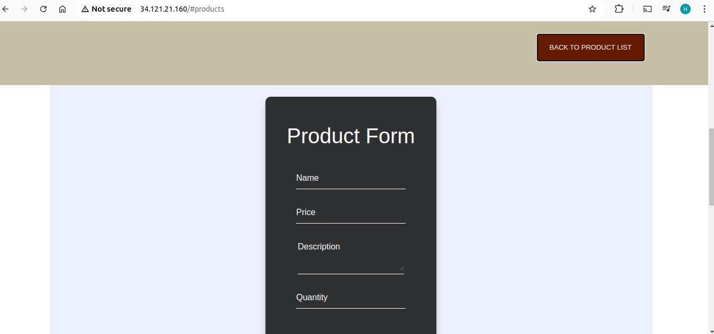

# Overview
This project involved the containerization and deployment of a full-stack yolo application using Docker.

# Requirements
Install the docker engine here:
- [Docker](https://docs.docker.com/engine/install/) 

Follow the following instructions to install vagrant:
- [Vagrant](https://cloudspinx.com/installation-of-vagrant-on-ubuntu/) 

## How to run the app
Use vagrant up --provison command

## How to access the Page

http://localhost:3000/

## Home Page

## Products Page

## Add Products Page

